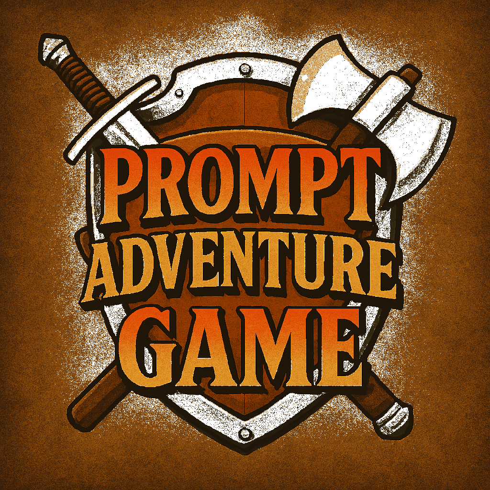

<p align="center">
  
</p>

# Prompt Adventure Game


<em><small>(Visual illustrations generated by DALL-E.)</small></em>

<p style="font-size:1.2rem;margin-top:2rem">A nostalgic text-based adventure game powered by AI, reminiscent of the classic 90's RPG text games.</p>

## About

Prompt Adventure Game is an AI-powered interactive storytelling experience that allows players to:

- Embark on unique text-based adventures that respond to your choices
- Choose from three immersive themes: pirate, space, and fantasy
- Experience dynamic stories that evolve based on your decisions
- Watch as AI generates custom imagery that brings your adventure to life

The game serves as both a prompt learning experience and a homage to the text adventures of the past, combining modern AI capabilities with classic gameplay.

## Prerequisites

Before running the game, you'll need:

- Node.js (v20+)
- npm
- **OpenAI API Key**: The game requires an OpenAI account with an API token and funds to generate content
  - [Sign up for OpenAI API access](https://platform.openai.com/signup)
  - [Add your payment method](https://platform.openai.com/account/billing/overview)
  - [Create an API key](https://platform.openai.com/account/api-keys)

## Installation

1. Clone the repository:

   ```
   git clone <repository-url>
   cd code-adventure-game
   ```

2. Install dependencies:

   ```
   npm install
   ```

3. Create a `.env` file in the root directory with your OpenAI API key:
   ```
   OPENAI_API_KEY=your_api_key_here
   ```

## Running the Game

Start the development environment with:

```
npm run dev
```

This command will:

- Start the Express server (backend)
- Launch the React client (frontend)
- Open the game in your default web browser

## Game Features

- **Three Immersive Themes**: Choose between pirate adventures on the high seas, space exploration in the far reaches of the galaxy, or fantasy quests in magical realms
- **AI-Generated Storytelling**: Each decision you make shapes a unique narrative crafted by AI
- **Dynamic Imagery**: The game generates images based on your story progression to enhance the experience
- **Text-Based Interface**: A clean, nostalgic interface reminiscent of classic text adventure games

## Technical Details

The project is structured as a monorepo with:

- A React-based frontend client
- An Express server backend
- OpenAI API integration for story and image generation
- Shared types and utilities

## Important Note

This game uses the OpenAI API which incurs usage costs. You will need to:

1. Have an OpenAI account
2. Add a payment method to your account
3. Monitor your API usage to avoid unexpected charges

### Privacy

This game will run locally on your computer and does not send any information or data to any outside servers or services.

### OpenAI API Usage Details

- **Models Used**: The game utilizes GPT models (gpt-4o-mini) for text generation and DALL-E models for image creation
- **Token Consumption**: Each game session will consume tokens based on:
  - Length of your adventure
  - Complexity of your choices
  - Number of images generated
- **Cost Considerations**: While costs are generally modest for typical gameplay sessions, they can add up with extended use.

### Recommended API Practices for controlling cost and ensuring security

- Create a dedicated API key specifically for this game
- Set up a spending limit in the [OpenAI usage limits panel](https://platform.openai.com/account/billing/limits)
- Regenerate or revoke your API key if you suspect it has been compromised
- Never share your API key or commit it to public repositories

## License

[Add your license information here]

## Acknowledgments

- The game pays homage to classic text adventure games of the 1990s
- Powered by OpenAI's advanced language and image generation capabilities
- All game content, including stories and images, is generated by AI
- Any similarities to existing copyrighted works, characters, or settings are entirely coincidental and unintentional, as all content is procedurally generated through artificial intelligence
